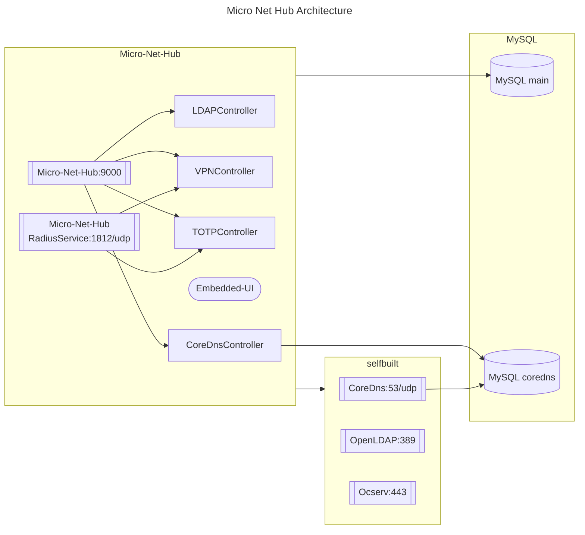

<!-- @format -->

# micro-net-hub

Basic tool for private network.

# References

- https://github.com/eryajf/go-ldap-admin (d00d6df)
- https://github.com/eryajf/go-ldap-admin-ui (c75476d)
- https://github.com/bjdgyc/anylink
- https://github.com/fivexl/golang-radius-server-ldap-with-mfa
- https://github.com/lework/lenav

# TODO

- UserManager
  - Delete Default Value of departmentNumber: 打工人; postalAddress: 地球.
  - Add comment for group entity of ou/cn.
- TOTPManager
- VPNManager
- CoreDnsManager

# Architechture

