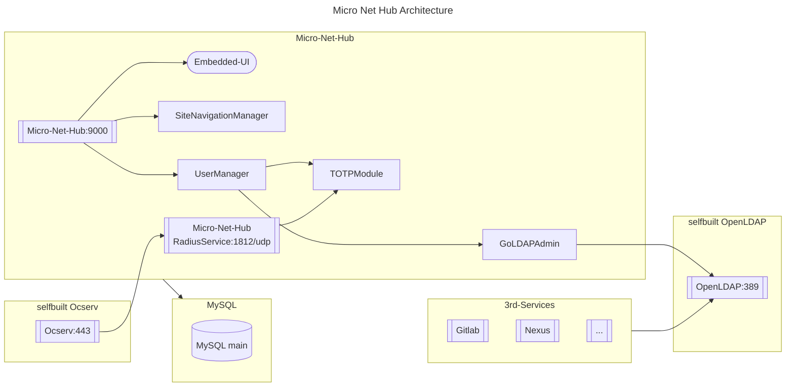

<!-- @format -->

<pre style="font-size: 32px; font-weight: bold; background-color: #000000; display: inline-table; text-align: center; line-height: 52px; padding: 12px 10px; border-radius: 5px;">
Micro
Net
Hub
</pre>

A tool for managing your OpenLDAP/Ocserv/Navigation at a private network.

# How to install Micro-Net-Hub

[Click to see the doc](docs/README.md)

# How to set Ocserv Authentication with Radius which build in Micro-Net-Hub.

[Click to see the doc](backend/internal/radiussrv/README.md)

# How to set OpenLdap and IM manager

[Go-LDAP-Admin - eryajf](http://ldapdoc.eryajf.net/pages/5683c6/#%E5%88%9D%E5%A7%8B%E6%95%B0%E6%8D%AE)

# References

- https://github.com/eryajf/go-ldap-admin
- https://github.com/gnimli/go-web-mini
- https://github.com/LyricTian/gin-admin
- https://github.com/go-admin-team/go-admin
- https://github.com/m-vinc/go-ldap-pool
- https://github.com/bjdgyc/anylink
- https://github.com/fivexl/golang-radius-server-ldap-with-mfa
- https://github.com/lework/lenav

# TODO

- VPNManager
- CoreDnsManager

# Architechture

