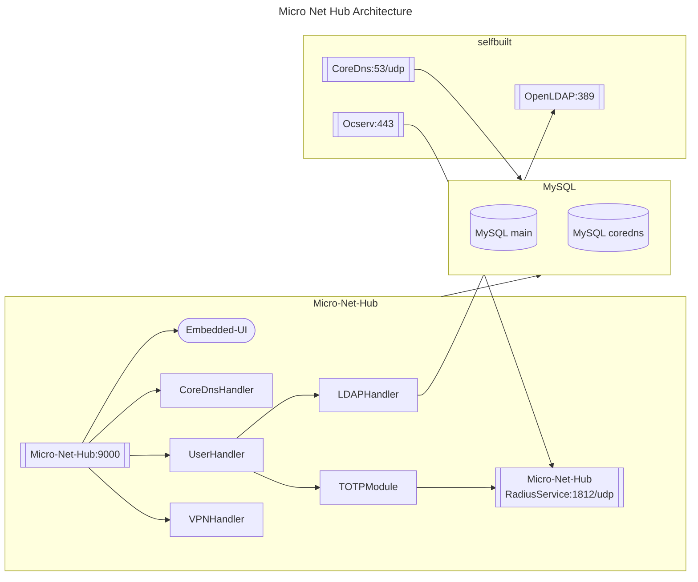
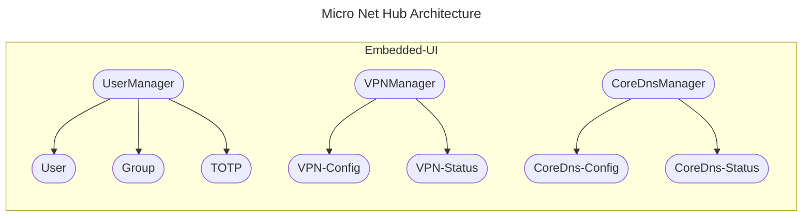

<!-- @format -->

# micro-net-hub

Basic tool for private network.

# How to set Ocserv Authentication with Radius.

> https://ocserv.openconnect-vpn.net/recipes-ocserv-authentication-radius-radcli.html

# References

- https://github.com/eryajf/go-ldap-admin
- https://github.com/gnimli/go-web-mini
- https://github.com/LyricTian/gin-admin
- https://github.com/go-admin-team/go-admin
- https://github.com/m-vinc/go-ldap-pool
- https://github.com/bjdgyc/anylink
- https://github.com/fivexl/golang-radius-server-ldap-with-mfa
- https://github.com/lework/lenav

# TODO

- VPNManager
- CoreDnsManager

# Architechture

